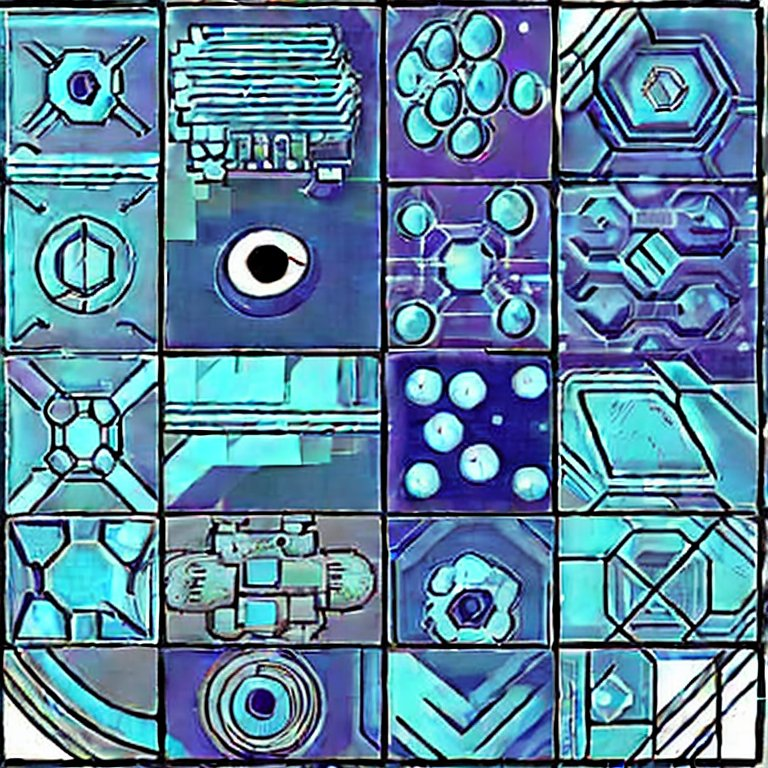

 
<h1> Machine learning for physicists </h1> 

1. **[Overview](materials/1_overview)**
   - Scientific machine learning with and without data
2. **[Machine learning practices](materials/2_handson)**
   - Hello world example: Hand-written digits recognition 
   - Programming frameworks, hardware, and workflow
3. **[A hitchhiker’s guide to deep learning](materials/3_hitchhiker)**
   - The four pillars: data, model, loss function, and optimization
   - Deep learning primitives: CNN, GNN, and transformer
4. **[Symmetries in machine learning](materials/4_symmetry)** 
   - Invariant and equivariant neural networks 
   - DeepMD, Euclidean equivariant GNN, Tensor field networks
   - Permutation symmetry and quantum wavefunctions
5. **[Differentiable programming](materials/5_diffprogram)**
   - The engine of deep learning: automatic differentiation on computation graphs
   - Differentiable DFT/MD/Tensor networks/..., and why they are useful
6. **[Generative models-I](materials/6_generative1)** 
   - A dictionary of generative models and statistical physics
   - Boltzmann machines
   - Autoregressive models
   - Variational autoencoders
7. **[Generative models-II](materials/7_generative2)** 
   - Normalizing flows
   - Diffusions models 
   - Applications of generative models to many-body problems
   - The Universe as a generative model
8. **[Wrap up](materials/8_whynow)**
   - AI for science: why now?   

*Title image generated by [stable diffusion]([https://huggingface.co/spaces/stabilityai/stable-diffusion) with the prompt: "a tile image for the course on 'Machine learning for physicists', eye-catching, artist style with sci-fi feeling".  (Yes, “tile” instead of "title" :P)*

